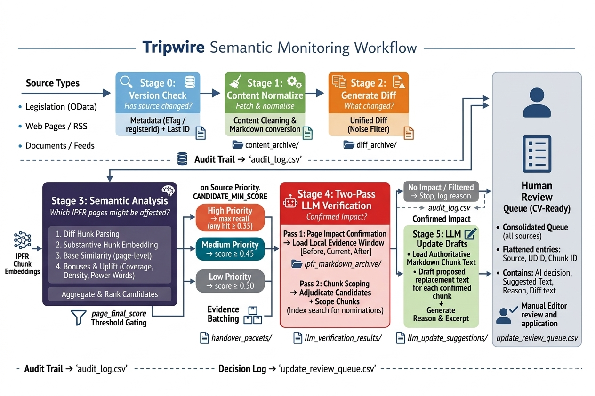
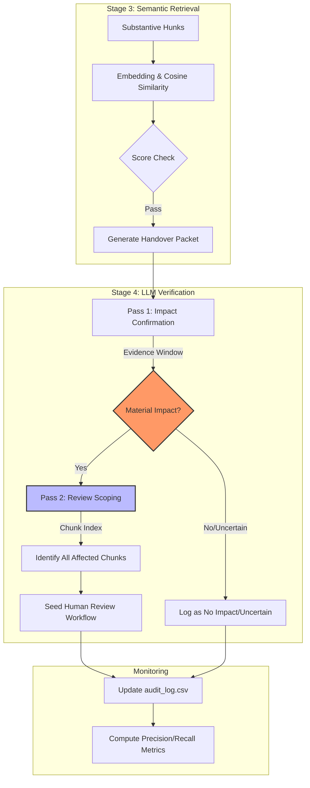

# Tripwire

## Objective

**Tripwire must maximize recall of plausible downstream impacts and minimize LLM prompt cost through evidence filtering, batching, and structured payloads. Final impact confirmation is to be performed by the LLM.**

Autonomous monitoring system for tracking substantive changes in authoritative Intellectual Property sources—such as Australian legislation and WIPO feeds—to detect updates that may impact IP First Response (IPFR) content. 

Tripwire is a recall‑first early warning system.

It asks:
**What might be impacted?**

The LLM answers:
**What is actually impacted?**

---

## System Overview

Tripwire operates as a staged pipeline:

```
Stage 0 → Source metadata detection (ETag/registerId)
Stage 1 → Content normalization (Cleaning & Markdown conversion)
Stage 2 → Diff generation (Unified diff vs. Archive)
Stage 3 → Semantic impact estimation & Routing
Stage 4 → Two-Pass LLM Verification & Review Scoping
```

---

## Architecture Diagram



---

## Stage Logic Summary

### Stage 0 – Version Detection

Sources are probed using lightweight metadata:

- Legislation → registerId
- WebPage / RSS → ETag / Content-Length

Purpose:

- Avoid unnecessary downloads  
- Detect objective source changes  
- Preserve auditability  

---

### Stage 1 – Content Normalization

Changed sources are fetched and cleaned:

- Remove navigation & layout artifacts  
- Normalize into Markdown / stable XML  

Purpose:

- Reduce diff volatility  
- Prevent false semantic triggers  

---

### Stage 2 – Diff Generation

Unified diffs are generated against archived content.

Tripwire reasons over changes, not full documents.

---

### Stage 3 – Semantic Impact Estimation

Diffs are parsed into semantic hunks.

Noise suppression removes:

- Page numbers  
- Standalone dates  
- Trivial fragments  

Substantive hunks are:

1. Embedded  
2. Compared against semantic chunk corpus  
3. Aggregated into page-level candidates  

#### Scoring and handover policy:
The `page_final_score` is calculated using a base similarity with additive bonuses:
* **Base Similarity**: The maximum chunk_similarity observed for a page.
* **Coverage Bonus**: +0.04 per unique hunk matched (capped at +0.12).
* **Density Bonus**: +0.01 per additional chunk hit (capped at +0.06).
* **Power Word Uplift**: Boosts based on legal imperatives (e.g., "must", "penalty", "Archives Act").

```
page_final_score =
    page_base_similarity # max chunk_similarity observed for a page before bonuses/uplift
  + coverage_bonus # which unique hunks contributed matches, captured with matched_hunks
  + density_bonus # how many passing chunk matches hit this page, captured with chunk_hits
  + power_word_uplift
```

#### Routing Thresholds
When Stage 3 triggers handover:

- Candidates ≥ candidate_min_score retained  
- No truncation of qualifying candidates  
- Batched via MAX_CANDIDATES_PER_PACKET  
- Structured JSON payloads generated  

Purpose:

- Minimize prompt tokens  
- Preserve evidence traceability  
- Enable deterministic batching
  
Handover is triggered based on source priority and the `CANDIDATE_MIN_SCORE` (0.35):

| Priority | Handover Trigger | Threshold Type |
| :--- | :--- | :--- |
| **High** | Any candidate ≥ 0.35 | Maximum Recall |
| **Medium** | Primary Score ≥ 0.45 | Balanced Filter |
| **Low** | Primary Score ≥ 0.50 | Efficiency First |


### Stage 4 - Two-Pass LLM Verification
Stage 4 executes a deterministic verification workflow to ensure high-fidelity results while minimizing token usage:

### Pass 1: Impact Confirmation
* **Input**: A "Local Evidence Window" from the IPFR markdown archive including Before, Current, and After context.
* **Task**: Verify if the external change materially impacts the specific IPFR section.
* **Output**: A structured decision (`impact`, `no_impact`, or `uncertain`) with grounded reasoning and evidence quotes.

### Pass 2: Review Scoping
* **Input**: A compact "Chunk Index" (IDs + snippets) of the entire candidate page.
* **Task**: Identify all other sections of the page that require human review based on the confirmed impact.
* **Output**: A list of `confirmed_update_chunk_ids` and `additional_chunks_to_review` to seed the human editing workflow.

---
## Stage 3 Tiered Processing Scenarios

| Priority | Strategy | Rationale | Workflow Detail |
| :--- | :--- | :--- | :--- |
| **High** | **Maximum Recall** | Never suppress high-risk sources. | **1. Summarize:** Detail the update immediately.<br>**2. Identify:** Map to all potentially influenced IPFR content.<br>**3. Verify:** Confirm actual influence with zero noise filtering. |
| **Medium** | **Balanced Filter** | Balance recall & cost. | **1. Filter:** Remove minor noise (formatting/boilerplate).<br>**2. Summarize:** Extract substantive changes.<br>**3. Map & Verify:** Identify and confirm content influence. |
| **Low** | **Efficiency First** | Suppress low-impact chatter. | **1. Extensive Filter:** Isolate only major textual or legal shifts.<br>**2. Summarize:** Brief overview of the core change.<br>**3. Map & Verify:** Identify and confirm impact only if thresholds are met. |

### Example


## Logs & Artifacts

| File | Role |
| :--- | :--- |
| `audit_log.csv` | Master ledger including Stage 0-3 metadata and **Stage 4 AI Verification results** (Decision, Confidence, and Overlap metrics). |
| `handover_packets/*.json` | Structured payloads containing evidence-ready hunks and verification targets. |
| `llm_verification_results/*.json` | Detailed per-candidate logs of the Pass 1/Pass 2 verification workflow. |
| `diff_archive/*.diff` | Raw change evidence. |

---

## Evaluation & Metrics

The system includes an evaluation suite (`evaluate_tripwire_llm.py`) to track pipeline performance:
* **Retrieval Precision/Recall**: Measures Stage 3's ability to find the correct candidate pages.
* **Verifier Precision/Recall**: Measures Stage 4's accuracy in confirming impacts.
* **Chunk Metrics**: Tracks the accuracy of Pass 2 in identifying specific sections for review.

