# Tripwire

## Objective

**Tripwire must maximize recall of plausible downstream impacts and minimize LLM prompt cost through evidence filtering, batching, and structured payloads. Final impact confirmation is to be performed by the LLM.**

Autonomous monitoring system for tracking substantive changes in authoritative Intellectual Property sources—such as Australian legislation and WIPO feeds—to detect updates that may impact IP First Response (IPFR) content. 

Tripwire is a recall‑first early warning system.

It asks:
**What might be impacted?**

The LLM answers:
**What is actually impacted?**

---

## System Overview

Tripwire operates as a staged pipeline:

```
Stage 0 → Source metadata detection (ETag/registerId)
Stage 1 → Content normalization (Cleaning & Markdown conversion)
Stage 2 → Diff generation (Unified diff vs. Archive)
Stage 3 → Semantic impact estimation & Routing
Stage 4 → Two-Pass LLM Verification & Review Scoping
Stage 5 → LLM Update Suggestions & Human Review Queue
```

---

## Architecture Diagram


---

## End-to-End Pipeline Diagram

```mermaid
flowchart TD

    %% ── STAGE 0 ──────────────────────────────────────────────────
    subgraph S0["🔍 Stage 0 — Has the source changed?"]
        direction TB
        SRC(["📋 Monitored sources\nLegislation · Web pages · RSS feeds"])
        PROBE["Check for a new version\nLegislation → register ID\nWeb / RSS → ETag or Content-Length"]
        CHK{"New version?"}
        SKIP(["⏭ No change — skip"])
        HEAL(["🩹 Archive missing — rebuild\nwithout generating a diff"])
        SRC --> PROBE --> CHK
        CHK -- "No" --> SKIP
        CHK -- "Yes" --> FETCH
        CHK -- "File missing" --> HEAL
    end

    %% ── STAGE 1 ──────────────────────────────────────────────────
    subgraph S1["🧹 Stage 1 — Fetch & normalise the content"]
        direction TB
        FETCH["Download the changed source"]
        subgraph S1_TYPES[" "]
            direction LR
            LEG["Legislation\n.docx or .html\n→ plain text"]
            WEB["Web page\nHeadless Chrome\n→ strip nav/footer/dates\n→ Markdown"]
            RSS["RSS feed\nSort items by GUID\nStrip transient dates"]
        end
        SAVE(["💾 Save normalised content\nto content archive"])
        FETCH --> S1_TYPES --> SAVE
    end

    %% ── STAGE 2 ──────────────────────────────────────────────────
    subgraph S2["📄 Stage 2 — What actually changed?"]
        direction TB
        DIFF["Compare new content\nagainst the archived version\n(unified diff)"]
        DIFFCHK{"Any\nsubstantive\nchanges?"}
        NOCHANGE(["No meaningful diff\n— log and stop"])
        SAVEDIFF(["💾 Save diff file\ndiff_archive/"])
        DIFF --> DIFFCHK
        DIFFCHK -- "No" --> NOCHANGE
        DIFFCHK -- "Yes" --> SAVEDIFF
    end

    %% ── STAGE 3 ──────────────────────────────────────────────────
    subgraph S3["🧠 Stage 3 — Which IPFR pages might be affected?"]
        direction TB
        HUNKS["Split the diff into\nindividual change hunks"]
        FILTER["Remove noise\ndates · page numbers · boilerplate"]
        SCORE["Score each hunk against\nevery IPFR content chunk\nusing semantic embeddings"]
        BOOST["Boost scores for\nlegal power words\nmust · shall · penalty · Archives Act"]
        RANK["Roll up to page-level scores\nand rank candidate pages"]
        GATE{"Score above\npriority threshold?"}
        GATEINFO["High  → any hit ≥ 0.35\nMedium → top score ≥ 0.45\nLow   → top score ≥ 0.50"]
        FILTERED(["Filtered — log and stop\nno LLM cost incurred"])
        PACKET(["📦 Package evidence\ninto handover packet\nhandover_packets/"])
        HUNKS --> FILTER --> SCORE --> BOOST --> RANK --> GATE
        GATEINFO -. "threshold policy" .-> GATE
        GATE -- "Below threshold" --> FILTERED
        GATE -- "Passes" --> PACKET
    end

    %% ── STAGE 4 ──────────────────────────────────────────────────
    subgraph S4["🤖 Stage 4 — Does this change actually impact IPFR?"]
        direction TB

        subgraph P1["Pass 1 — Page impact confirmation"]
            direction TB
            WINDOW["Load the best-matching chunk\nplus its neighbours as context\n[Before] · [Current] · [After]"]
            P1Q["Ask the LLM:\nDoes this change materially\naffect this IPFR page?"]
            P1D{"Decision"}
            P1NO(["No impact\n— stop here"])
            P1UNC(["Uncertain\n— flag for review\nno further LLM cost"])
            P1YES["✅ Impact confirmed\npage is affected"]
            WINDOW --> P1Q --> P1D
            P1D -- "No impact" --> P1NO
            P1D -- "Uncertain" --> P1UNC
            P1D -- "Impact" --> P1YES
        end

        subgraph P2["Pass 2 — Chunk scoping"]
            direction TB
            TARGETS["Show the LLM every candidate chunk\nwith its own snippet and matched hunks"]
            P2Q["Ask the LLM:\nWhich specific chunks need updating?\nAre there any others on the page?"]
            P2OUT["Output:\n✅ Confirmed chunks — need updating\n🔁 Additional chunks — human review\n❌ Rejected chunks — not affected"]
            FALLBACK["If LLM fails:\nkeep Pass 1 chunk\nas a safe fallback"]
            TARGETS --> P2Q --> P2OUT
            P2Q -- "LLM error" --> FALLBACK
        end

        P1YES --> TARGETS
        SAVERESULT(["💾 Save verification result\nllm_verification_results/"])
        P2OUT & FALLBACK --> SAVERESULT
    end

    %% ── STAGE 5 ──────────────────────────────────────────────────
    subgraph S5["✏️ Stage 5 — Draft the content updates"]
        direction TB
        SUGGEN["For each confirmed chunk,\nask the LLM to draft\nproposed replacement text\nbased on the diff and current content"]
        SUGOUT["Output per chunk:\n• Proposed replacement text\n• Reason for the change\n• Relevant diff excerpt\n• Update required flag"]
        SAVESUG(["💾 Save update suggestions\nllm_update_suggestions/"])
        SUGGEN --> SUGOUT --> SAVESUG
    end

    %% ── REVIEW QUEUE ─────────────────────────────────────────────
    subgraph RQ["📋 Human Review Queue"]
        direction TB
        CSV["Flatten all suggestions\ninto a single CSV\none row per chunk"]
        COLS["Each row contains:\nSource · UDID · Chunk ID\nSuggested replacement text\nReason · Relevant diff · Status"]
        EDITOR[/"👤 Human editor\nreviews update_review_queue.csv\nand applies approved changes to IPFR"/]
        CSV --> COLS --> EDITOR
    end

    %% ── AUDIT LOG ────────────────────────────────────────────────
    AUDIT(["📊 audit_log.csv\nContinuous ledger across all stages\nversion IDs · scores · AI decisions\nverification files · overlap metrics"])

    %% ── STAGE CONNECTIONS ────────────────────────────────────────
    SAVE --> DIFF
    SAVEDIFF --> HUNKS
    PACKET --> WINDOW
    SAVERESULT --> SUGGEN
    SAVESUG --> CSV
    S0 & S2 & S3 & S4 & S5 -.-> AUDIT

    %% ── STYLES ───────────────────────────────────────────────────
    classDef stage0 fill:#E8F1FB,stroke:#4A90E2,color:#0B2545
    classDef stage1 fill:#EAF7EE,stroke:#34A853,color:#123524
    classDef stage2 fill:#FFF4E5,stroke:#FB8C00,color:#5D3200
    classDef stage3 fill:#F3E8FF,stroke:#8E44AD,color:#3D1A52
    classDef stage4 fill:#FCE8E6,stroke:#DB4437,color:#5C1F1A
    classDef stage5 fill:#E6F4EA,stroke:#188038,color:#16351F
    classDef review fill:#FDF6E3,stroke:#C9A800,color:#3D2E00
    classDef audit fill:#EEF3F7,stroke:#7B8A97,color:#23313F

    class S0 stage0
    class S1 stage1
    class S2 stage2
    class S3 stage3
    class S4 stage4
    class S5 stage5
    class RQ review
    class AUDIT audit
```



---

## Stage Logic Summary

### Stage 0 – Version Detection

Sources are probed using lightweight metadata:

- Legislation → registerId
- WebPage / RSS → ETag / Content-Length

Purpose:

- Avoid unnecessary downloads  
- Detect objective source changes  
- Preserve auditability  

---

### Stage 1 – Content Normalization

Changed sources are fetched and cleaned:

- Remove navigation & layout artifacts  
- Normalize into Markdown / stable XML  

Purpose:

- Reduce diff volatility  
- Prevent false semantic triggers  

---

### Stage 2 – Diff Generation

Unified diffs are generated against archived content.

Tripwire reasons over changes, not full documents.

---

### Stage 3 – Semantic Impact Estimation

Diffs are parsed into semantic hunks.

Noise suppression removes:

- Page numbers  
- Standalone dates  
- Trivial fragments  

Substantive hunks are:

1. Embedded  
2. Compared against semantic chunk corpus  
3. Aggregated into page-level candidates  

#### Scoring and handover policy:
The `page_final_score` is calculated using a base similarity with additive bonuses:
* **Base Similarity**: The maximum chunk_similarity observed for a page.
* **Coverage Bonus**: +0.04 per unique hunk matched (capped at +0.12).
* **Density Bonus**: +0.01 per additional chunk hit (capped at +0.06).
* **Power Word Uplift**: Boosts based on legal imperatives (e.g., "must", "penalty", "Archives Act").

```
page_final_score =
    page_base_similarity # max chunk_similarity observed for a page before bonuses/uplift
  + coverage_bonus # which unique hunks contributed matches, captured with matched_hunks
  + density_bonus # how many passing chunk matches hit this page, captured with chunk_hits
  + power_word_uplift
```

#### Routing Thresholds
When Stage 3 triggers handover:

- Candidates ≥ candidate_min_score retained  
- No truncation of qualifying candidates  
- Batched via MAX_CANDIDATES_PER_PACKET  
- Structured JSON payloads generated  

Handover is triggered based on source priority and the `CANDIDATE_MIN_SCORE` (0.35):

| Priority | Handover Trigger | Threshold Type |
| :--- | :--- | :--- |
| **High** | Any candidate ≥ 0.35 | Maximum Recall |
| **Medium** | Primary Score ≥ 0.45 | Balanced Filter |
| **Low** | Primary Score ≥ 0.50 | Efficiency First |


### Stage 4 - Two-Pass LLM Verification
Stage 4 executes a deterministic two-pass verification workflow to ensure high-fidelity results while minimising token usage.

### Pass 1: Page Impact Confirmation
* **Input**: A narrow 3-chunk "Local Evidence Window" — the best-scoring Stage 3 candidate chunk (`[Current]`), plus its immediate predecessor (`[Before]`) and successor (`[After]`) for context. The target chunk is selected by a lexical scorer (`_select_pass1_target_chunk_id`) that picks the Stage 3 candidate chunk with the highest token overlap and phrase hit rate against the diff.
* **Task**: Decide whether the external change materially impacts the **candidate IPFR page as a whole**. The target chunk is used as a probe to test page-level impact — it is not treated as the final or only impacted chunk. Pass 1 does not scope which chunks need updating; that is deferred entirely to Pass 2.
* **Decision**: `impact` / `no_impact` / `uncertain`. Impact is confirmed if the external change updates, contradicts, invalidates, or materially expands or narrows the page's guidance, or if the page would become incomplete or misleading without reflecting the change.
* **Output**: A structured JSON decision with `udid`, `chunk_id` (the probe chunk), `confidence`, `reason`, and a short `evidence_quote` grounded in the evidence window.

### Pass 2: Chunk Scoping
* **Input**: Per-chunk verification targets — each Stage 3 candidate chunk with its own local snippet window and matched hunk IDs — plus a full page chunk index (all chunk IDs and snippets) for optional nominations beyond the Stage 3 set.
* **Task**: Adjudicate every Stage 3 candidate chunk individually to determine which chunks are materially affected. The LLM may also nominate additional chunks not in the Stage 3 set if the page chunk index justifies it. Stage 3 chunks may only be rejected if their own snippet clearly shows no material impact; when in doubt they are preserved in `additional_chunks_to_review`.
* **Output**: `confirmed_updates` (chunk ID + matched hunk IDs + reason + evidence quote), `additional_chunks_to_review` (same structure, for human review), and `rejected_stage3_chunk_ids`. If Pass 2 fails or returns invalid JSON, a fallback promotes the Pass 1 probe chunk into `additional_chunks_to_review` so no signal is lost.

## Logs & Artifacts

| File | Role |
| :--- | :--- |
| `audit_log.csv` | Master ledger including Stage 0-3 metadata and **Stage 4 AI Verification results** (Decision, Confidence, and Overlap metrics). |
| `handover_packets/*.json` | Structured payloads containing evidence-ready hunks and verification targets. |
| `llm_verification_results/*.json` | Detailed per-candidate logs of the Pass 1/Pass 2 verification workflow. |
| `llm_update_suggestions/*.json` | Draft proposed replacement text per confirmed chunk, including reason and relevant diff. |
| `diff_archive/*.diff` | Raw change evidence. |
| `update_review_queue.csv` | Flat, human-readable queue consolidating all suggested updates and review-only chunks across all sources. |

---

## Evaluation & Metrics

The system includes an evaluation suite (`evaluate_tripwire_llm.py`) to track pipeline performance:
* **Retrieval Precision/Recall**: Measures Stage 3's ability to find the correct candidate pages.
* **Verifier Precision/Recall**: Measures Stage 4's accuracy in confirming impacts.
* **Chunk Metrics**: Tracks the accuracy of Pass 2 in identifying specific sections for review.
